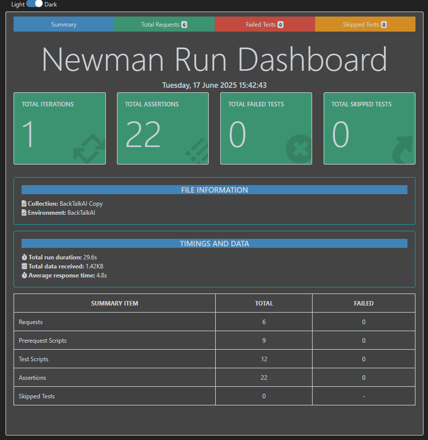

# 🧪 BackTalkAI – Postman API Testing Collection

``API testing collection using Postman and Newman with detailed reports.``

This repository demonstrates automated API testing for the **BackTalkAI** project using **Postman** and **Newman**. It includes robust test scripts, environment variable usage, negative test cases, and detailed HTML test reports.

---

## 📦 Project Contents

| File Name                             | Description                                                              |
|--------------------------------------|--------------------------------------------------------------------------|
| `BackTalkAI.postman_collection.json` | Postman collection with API tests (Signup, Signin, Forgot Password, Chat)|
| `BackTalkAI.postman_environment.json`| Postman environment file (with base URL and collection variables)        |
| `BackTalkAI_API_report.html`         | Newman HTML report (22 assertions, 0 failures)                           |
| `BackTalkAi_API_report_4time_run.html`| Extended Newman report (4 iterations, all passed)                      |
| `screenshots/report-summary.png`     | Optional screenshot from the test report                                 |

---

## 🧰 Tools & Technologies

- [Postman](https://www.postman.com/)
- [Newman](https://www.npmjs.com/package/newman)
- [htmlextra Reporter](https://github.com/DannyDainton/newman-reporter-htmlextra)

---

## 🚀 How to Run the Tests

### 1. Install Newman and HTML Reporter globally

```bash
npm install -g newman newman-reporter-htmlextra
```

### 2. Run the Collection

```bash
newman run BackTalkAI.postman_collection.json -e BackTalkAI.postman_environment.json -r htmlextra --reporter-htmlextra-export BackTalkAI_API_report.html
```

### 3. Run the Test 4 Times

```bash
newman run BackTalkAI.postman_collection.json -e BackTalkAI.postman_environment.json -r htmlextra --iteration-count 4 --reporter-htmlextra-export BackTalkAi_API_report_4time_run.html
```

---

## ✅ Test Coverage Highlights

- 🔐 Authentication: Signup, Signin, Forgot Password, Reset Password, Token Verification
- 🤖 AI Chat: Test dynamic text/image prompt
- ⚠️ Negative Scenarios: Email validation, OTP error cases
- ⏱️ Response Time & Schema Validation: Includes response time, header, content-type checks

---

## 📊 Sample Report Screenshot



---

## 🔗 Postman Cloud Link

📎 [View Postman Collection](https://lunar-firefly-999126.postman.co/workspace/API-key~c5a74af9-79da-4c42-a7c3-e5d43fdad2dd/collection/22742638-e1a54a11-f31a-4714-997a-db808abfc1e7?action=share&creator=22742638&active-environment=22742638-c384587a-8b0d-4f29-b06b-4628903eb0ea)

---

## 👨‍💻 Author

**AB Rahman**  
_Manual + Automation QA Enthusiast_  
📧 Email: [abdurtutul6@gmail.com](mailto:abdurtutul6@gmail.com)
